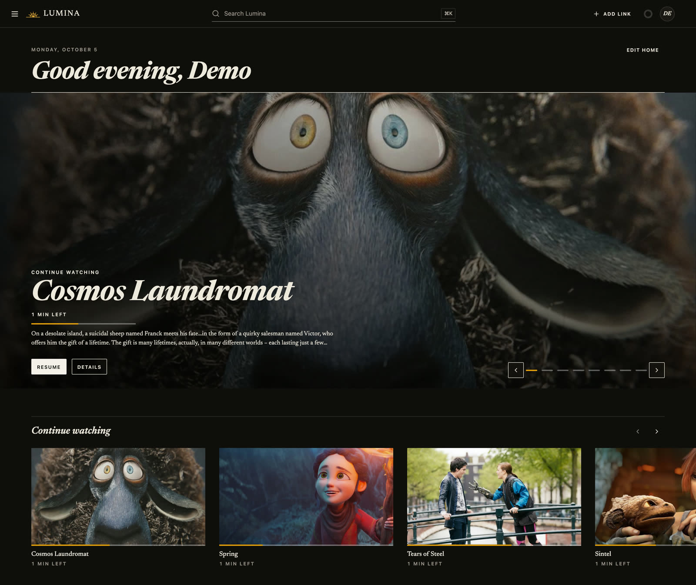
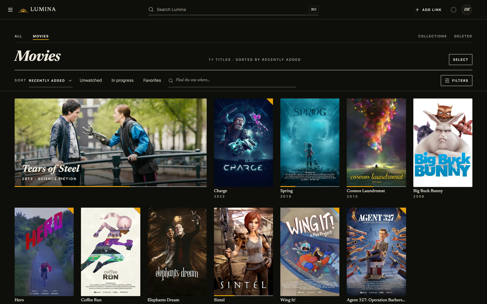

<p align="center">
  
</p>

<h1 align="center">Lumina</h1>

<p align="center">
  <b>Your household's own streaming service.</b><br>
  Stream and save from YouTube and Twitch, then watch it next to your movies, TV and music,<br>
  in the browser or any Jellyfin app.
</p>

<p align="center">
  <a href="LICENSE"></a>
  
  
</p>

<p align="center">
  <a href="#run">Install</a> ·
  <a href="docker/README.md">Operator guide</a> ·
  <a href="RELEASE_NOTES.md">Release notes</a> ·
  <a href="CONTRIBUTING.md">Contributing</a>
</p>

<p align="center">
  
</p>

<table>
  <tr>
    <td width="50%"><b>One search</b><br>YouTube, the channels you follow and your own library in one box. Watch now, save with one click.</td>
    <td width="50%"><b>Live</b><br>YouTube and Twitch live streams with chat, and chat replay for finished broadcasts.</td>
  </tr>
  <tr>
    <td><b>Your library</b><br>Movies, TV, music and downloads with TMDB artwork and a full metadata editor. Folders import read-only and stay watched.</td>
    <td><b>Any screen</b><br>Infuse and other Jellyfin apps connect directly. Direct play, remux or transcode, with Intel QSV/VAAPI.</td>
  </tr>
  <tr>
    <td><b>The whole household</b><br>Members, invitations, per-member limits, two-step verification, and requests through Sonarr and Radarr.</td>
    <td><b>Private by default</b><br>Loopback-only until you open it up. Recommendations run locally; AI transcripts and summaries are optional and can run on-device.</td>
  </tr>
</table>

<p align="center">
  
</p>

## Run

Needs Docker with Compose, on amd64 or arm64.

```bash
git clone https://github.com/shiftedx/lumina && cd lumina
printf 'LUMINA_RUNTIME_UID=%s\nLUMINA_RUNTIME_GID=%s\n' "$(id -u)" "$(id -g)" > .env
docker compose up --build -d
```

Open <http://127.0.0.1:8765> and create the first admin.

| To | See |
| --- | --- |
| Configure, add media folders, back up, upgrade | [Operator guide](docker/README.md) |
| Reach it from other devices | [Remote HTTPS](docker/README.md#remote-https) · [LAN HTTP mode](docker/README.md#lan-http-mode) |
| Use hardware transcoding | [Intel QSV/VAAPI](docker/README.md#hardware-transcoding-intel-qsvvaapi) |
| Connect Infuse or another Jellyfin app | [Jellyfin apps](docker/README.md#jellyfin-apps-infuse-swiftfin) |
| Report a vulnerability | [Security policy](SECURITY.md) |

## Develop

Toolchain versions are pinned in `.tool-versions` (install them with [mise](https://mise.jdx.dev)).

```bash
mise install
mise exec -- make bootstrap   # backend venv + frontend deps
./scripts/run-dev.sh          # backend :8765, UI :5173
mise exec -- make check       # full test gate, required before a PR
```

FastAPI and SQLite in `backend/`, React, TypeScript and Vite in `frontend/`. Architecture decisions live in [`docs/adr/`](docs/adr/). Start with [CONTRIBUTING.md](CONTRIBUTING.md), or [AGENTS.md](AGENTS.md) for coding agents.

## Scope

Lumina plays public sources only. It stores no provider credentials and does not handle DRM. You are responsible for following the terms of the sites you use.

Screenshot content: [Blender Studio](https://studio.blender.org) open movies (CC BY), artwork via [TMDB](https://www.themoviedb.org). Lumina uses the TMDB API but is not endorsed or certified by TMDB.

## License

[AGPL-3.0-or-later](LICENSE)
